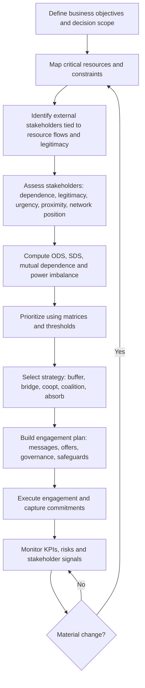
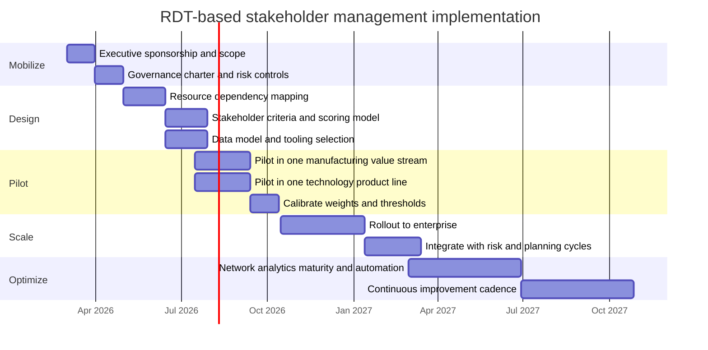

# Resource Dependence Theory as a Foundation for an Influence-Based Stakeholder Management System

## Executive summary

Resource Dependence Theory (RDT) explains organizational behavior by treating organizations as open systems whose survival and performance depend on resources controlled by external actors. Because resources are unevenly distributed, external actors can constrain organizational discretion. The core managerial problem is not simply “planning” but managing dependencies and power relations so critical resource flows remain reliable while organizational autonomy is preserved.

RDT is especially useful for stakeholder management where the organization lacks legitimate coercive authority over external stakeholders (it cannot command compliance) and must instead rely on influence grounded in exchange relations. In the power-dependence tradition, power is rooted in the other party’s dependence: the more you need what they control and the fewer alternatives you have, the more leverage they possess.

This report translates RDT into a practical stakeholder management system designed for external stakeholder assessment and engagement. The system is built around four operational moves that mirror RDT’s logic:

1) **Make dependencies visible** by mapping which stakeholders control, mediate or legitimize the resources required for business objectives  
2) **Measure dependence and power** using criteria grounded in RDT and complementary stakeholder frameworks (resource criticality, scarcity, substitutability, control, legitimacy, urgency, proximity and network centrality)
3) **Select influence strategies matched to dependence structure**, emphasizing non-coercive mechanisms: buffering (reduce exposure), bridging (build collaborative links), cooptation (bring stakeholders into governance), coalition building and negotiated arrangements such as alliances or joint ventures
4) **Institutionalize governance and monitoring** so stakeholder risk and opportunity are managed like strategic risk, with clear ownership, cadence, escalation and KPIs

Implementation guidance is provided with roles, workflows, tools, timeline, change-management considerations and illustrative manufacturing and technology cases. Throughout, limitations and critiques of RDT are treated as design constraints for a stakeholder system (not reasons to discard RDT).

## RDT origins, key authors and assumptions

RDT emerged in the 1970s as a major organization-environment perspective alongside other paradigms of that era. In a widely cited retrospective, Gerald F. Davis and J. Adam Cobb situate RDT’s major statements in the mid-1970s and emphasize that the approach integrates a theory of interorganizational power with a theory of how organizations attempt to manage their environments.

The canonical statement is The External Control of Organizations by Jeffrey Pfeffer and Gerald R. Salancik, reissued with a new preface in the early 2000s. Publisher descriptions emphasize its central argument: because organizations depend on the environment, external constraint and control are “possible and almost inevitable,” and organizations respond by attempting to change environments politically or by forming interorganizational relationships that control or absorb uncertainty.

RDT is not an isolated invention. It synthesizes and extends earlier building blocks:

- Richard M. Emerson provided a foundational power-dependence relation (Pab = Dba), linking power directly to dependence and emphasizing that dependence is shaped by motivational investment and the availability of alternatives.  
- James D. Thompson highlighted interdependence and coordination as central problems of organization design and distinguished different kinds of task interdependence that require different coordination mechanisms.  
- Howard E. Aldrich and Pfeffer framed interorganizational relations as a special case of the broader study of organizations and environments, explicitly contrasting environmental selection perspectives with decision-making perspectives that stress strategic adaptation.

Across these influences, RDT’s core assumptions (as used in later reviews and syntheses) can be stated in stakeholder-relevant terms:

First, **organizations are not self-sufficient**: they require external inputs and support, including tangible resources (materials, capital, labor and technology) and intangible resources (information and legitimacy).

Second, **external actors can impose constraints** because they control the flow of resources the organization values and cannot easily replace.

Third, **managers are not purely efficiency optimizers**; they are also political actors who seek organizational survival and managerial autonomy and will deploy tactics that reshape dependence patterns, sometimes prioritizing power and control considerations over narrow profit logic.

Fourth, **organizations can attempt to enact or negotiate their environments**, not merely adapt to them. This includes selecting governance mechanisms and interorganizational arrangements that reduce uncertainty and dependence.

## Mechanisms of dependence, power and interdependence

### Dependence as the micro-foundation of influence without coercion

In influence-based stakeholder contexts, the highest-value RDT idea is that coercion is not required for control. Power can arise from ordinary exchange relations. Emerson’s formulation makes this explicit: the power of A over B is based on B’s dependence on A and dependence varies inversely with alternative sources.

This power-dependence logic fits the user’s condition: when an organization lacks legitimate authority over an external stakeholder, it can still shape outcomes by (a) reducing its dependence, (b) increasing the other party’s dependence, (c) reframing the exchange so there are mutual gains, or (d) mobilizing third parties who can influence the stakeholder.

### Observable drivers of dependence and stakeholder leverage

RDT operationalizes dependence in ways that translate cleanly into stakeholder assessment criteria:

- **Resource importance / criticality**: how essential the resource is to core operations and objectives
- **Concentration and substitutability**: whether control of the resource is concentrated and whether the focal organization has viable alternatives
- **Discretion / control over access and use**: whether the stakeholder can withhold the resource, impose conditions or redirect it to others 
- **Legitimacy as a resource**: later syntheses treat legitimacy as improving resource access by aligning with social guidelines and by signaling propriety, which can matter for regulators, communities, talent and investors.

A meta-analytic synthesis describes RDT’s central prediction: organizations form interorganizational arrangements (interlocks, alliances, joint ventures, in-sourcing, M&A) to cope with interdependencies by bolstering autonomy and legitimacy.

### Interdependence types and why they matter for stakeholder engagement design

RDT-based stakeholder management improves when it distinguishes different *forms* of interdependence, because each implies different coordination and engagement mechanisms.

A commonly used typology (drawn from Thompson) distinguishes:

- **Pooled interdependence**: parties act largely independently, but their combined contributions drive outcomes; managed through standardization (rules, scope clarity)
- **Sequential interdependence**: one party’s outputs are another’s inputs; managed through planning, sequencing and interfaces
- **Reciprocal interdependence**: mutual adjustment is required because outputs and inputs cycle; this requires the most intense coordination and ongoing information exchange

For stakeholder management, these categories help decide whether engagement should be structured as periodic updates (pooled), planned handoffs and service levels (sequential) or joint governance with continuous feedback loops (reciprocal).

### Mutual dependence and power imbalance as two separate dimensions

A major refinement in the RDT literature is the separation of **mutual dependence** (the sum of dependencies) from **power imbalance** (the differential). A meta-analysis reports critiques that earlier RDT work sometimes conflated these dimensions under “interdependence,” echoing arguments by Casciaro and Piskorski that this reduces empirical testability.

For stakeholder management system design, this distinction is practical:

- High mutual dependence often creates incentives for stable negotiated arrangements  
- High power imbalance often increases vulnerability for the weaker party and reduces the stronger party’s incentive to accept constraints unless broader benefits exist (reputation, legitimacy, coalition pressure, long-term risk reduction)

## RDT strategies for managing dependence and uncertainty

RDT is unusually managerial in that it catalogs tactics for altering dependence structures. In the Davis and Cobb synthesis, tactics range from minimally constraining moves (maintain alternatives) to highly constraining ones (mergers and acquisitions), with intermediate options such as associations, alliances and cooptation.

### Buffering and bridging as strategy families

A widely used classification groups RDT tactics into **buffering** and **bridging**. Buffering protects the technical core by reducing exposure to environmental fluctuations (stockpiles, forecasting, leveling and capacity adjustments). Bridging modifies boundaries by linking with exchange partners, competitors and regulators to make resource flows more predictable.

In stakeholder terms, buffering tends to be “systems” work (design, sourcing, financial slack), while bridging is “relationship” work (alliances, governance interfaces, negotiated commitments). Most mature stakeholder systems need both, because bridging without buffering can overexpose autonomy and buffering without bridging can miss opportunities to reshape the environment.

### Strategy repertoire and how each maps to influence

RDT’s commonly cited options include mergers or vertical integration, joint ventures and other interorganizational relationships, boards of directors, political action and executive succession.

Below is an influence-focused interpretation of the major RDT strategies, including those requested by the user.

**Boundary management and information control.** RDT recognizes that influence attempts are mediated by information channels and observability. Stakeholder systems operationalize this ethically as: (a) controlled interfaces (single points of contact), (b) disciplined disclosure, (c) structured consultation processes and (d) evidence-based narratives that maintain credibility. In community and public-sector engagement, practice handbooks emphasize that engagement choices and transparency shape acceptance and legitimacy.

**Bridging through alliances, joint ventures and contracting.** Interorganizational arrangements can stabilize critical inputs, share knowledge and spread risk. The meta-analysis frames these arrangements as responses to dependencies, with expected autonomy and legitimacy benefits.

**Cooptation and governance inclusion.** RDT highlights cooptation: bringing representatives of constraint sources into decision structures, often through boards or advisory councils, effectively trading some sovereignty for support and predictability. Davis and Cobb explicitly describe inviting constraint sources onto governing boards as a way to manage uncertainty.

**Coalitions and collective action.** Joining associations or coordinated councils is a lower-constraint strategy that can amplify influence by shifting from dyadic dependence to networked dependence. Network research on stakeholder influence emphasizes that dense ties among stakeholders can increase their ability to coordinate and sustain pressure, increasing their influence.

**Mergers and vertical integration.** The most constraining strategy is absorbing the source of dependence, typically through acquisition or vertical integration. The meta-analysis quotes Pfeffer and Salancik on absorbing interdependence via mergers and treats M&A as an ownership-based arrangement for durable access to desired inputs.

**Political action.** Publisher descriptions of The External Control of Organizations emphasize that organizations may try to change environments through political means. In stakeholder systems, this translates to nonmarket strategy: engagement with regulators, standards bodies and policy coalitions, ideally grounded in transparent evidence and ethical safeguards.

### Constraints and ethical guardrails implied by research

RDT strategies can conflict with legal and ethical boundaries. The meta-analysis explicitly treats antitrust rules as boundary conditions, noting that shifts in competition law can change the feasibility and performance of mergers and can push organizations toward alternative arrangements. citeturn46view0turn45view1

For a stakeholder management system, this means: high-power interventions (exclusive agreements, acquisitions, cartel-like coordination) must be routed through governance controls (legal review, conflicts checks, compliance sign-off and documentation). citeturn45view1turn43view4

## Translating RDT into a stakeholder management system

### System objectives and scope

An RDT-based stakeholder management system is an operating capability that answers two questions continuously:

1) Which external stakeholders can materially affect the organization’s business objectives because they control, influence or legitimize critical resources? citeturn44view1turn19view0turn7view4  
2) Given the organization’s dependence structure, what engagement strategy increases the reliability of resource flows and the organization’s autonomy while remaining lawful and ethically defensible? citeturn22view4turn46view0turn43view4

Because the user specified **no industry**, this system is designed to be industry-agnostic. Illustrations later use manufacturing and technology for concreteness.

### Stakeholder identification and mapping methods grounded in resource flows

RDT suggests that stakeholder identification should begin from **resource and constraint mapping**, not from generic stakeholder lists. A practical sequence is:

- Start from business objectives (growth, resilience, time-to-market, quality, safety, license to operate)  
- Identify resource requirements and dependencies that enable those objectives (inputs, distribution access, permits, financing, standards compliance and legitimacy) citeturn44view1turn19view0turn48view0  
- Identify stakeholders who control or can significantly influence those resource flows, including those external to the core operation such as communities, local government authorities and civil society organizations, consistent with stakeholder engagement guidance. citeturn3search13turn7view4  
- Map relationships as a network, not only as dyads, because stakeholder influence often travels via coalitions, alliances and dense stakeholder ties. citeturn42view1turn42view2turn47view0

This aligns with widely used engagement standards that treat stakeholder identification, planning, execution and integration into decision-making as a managed process rather than an ad hoc communications activity. citeturn43view2turn7view4

### Assessment criteria tailored to influence-without-authority contexts

The user requested specific criteria. The system below integrates RDT constructs with complementary stakeholder frameworks:

- **Resource criticality** (RDT): importance of the resource to objectives and operations citeturn22view4turn46view0  
- **Scarcity** (RDT/power-dependence): supply-demand imbalance, including time sensitivity citeturn7view0turn32view1  
- **Substitutability** (power-dependence): availability of alternatives and switching feasibility citeturn7view0turn22view4  
- **Control / discretion** (RDT): stakeholder ability to withhold, condition or redirect resource flows citeturn7view0turn38view0  
- **Legitimacy** (stakeholder salience and legitimacy literature): whether claims are perceived as appropriate and valid citeturn7view5turn46view0  
- **Urgency** (stakeholder salience): time sensitivity and criticality of stakeholder claims citeturn7view5turn47view0  
- **Proximity** (expanded salience criteria): closeness in space, time or operational exposure and in some fields used as an explicit prioritization criterion citeturn47view0turn4search8  
- **Network centrality** (network influence): stakeholder position that enables mobilization of others (betweenness, eigenvector, connectivity) citeturn42view2turn42view1

#### Comparative view of stakeholder assessment frameworks

The table below positions RDT relative to common stakeholder assessment frameworks and practitioner standards, emphasizing what each contributes when coercion is unavailable.

| Framework | Core logic | Value for influence-based stakeholder management | Gaps the RDT-based system should compensate for |
|---|---|---|
| RDT | Manage dependencies by reshaping interorganizational relations to secure critical resources and autonomy | Directly links stakeholders to resource flows, predicts which relationship forms reduce dependence and uncertainty | Can under-specify normative legitimacy and can conflate mutual dependence with power imbalance if not measured separately citeturn44view1turn46view0 |
| Salience model (power, legitimacy, urgency) | Managers attend to stakeholders based on perceived possession of attributes | Adds legitimacy and urgency so prioritization is not solely “who controls inputs” | Attribute scoring can become perception-driven and may miss network effects citeturn7view5turn47view0 |
| Power-interest mapping | Prioritize by power to influence and interest in the outcome | Simple communication tool for engagement intensity decisions | Does not specify resource mechanisms, over-simplifies indirect influence paths citeturn27search11turn47view0 |
| Stakeholder influence strategies (RDT-derived) | Stakeholders influence firms via withholding or usage strategies, directly or via allies | Helps anticipate stakeholder tactics and design responsive engagement and risk controls | Focuses on influence “on” the firm and less on how the firm ethically builds mutual dependence citeturn38view0turn38view1 |
| Engagement standards and handbooks | Structured process: identify, plan, execute, integrate, monitor | Provides governance-oriented workflow, inclusivity principles and practical engagement methods | Often less analytical about dependence structure and power imbalance citeturn43view2turn7view4turn43view3 |
| Social responsibility guidance | Identify and engage stakeholders, integrate SR across governance and operations | Strengthens legitimacy, transparency and accountability norms that support durable influence | Not designed to compute dependence metrics or tactics for constraint absorption citeturn48view0turn43view4 |

### Scoring model and metrics

The system uses two core indices that make RDT measurable:

- **Organization Dependence on Stakeholder (ODS)**: how dependent the organization is on a stakeholder for critical resources  
- **Stakeholder Mobilization and Influence Potential (SMIP)**: how capable the stakeholder is of converting preferences into influence through networks, legitimacy and urgency

A workable scoring model uses a 0–5 scale per metric, with weights chosen per business objective (weights must be revisited when objectives change, consistent with guidance that prioritization criteria weights shift by decision context). citeturn47view0

**Suggested ODS components (RDT-heavy):**

- Criticality (weight high)  
- Scarcity  
- Substitutability (reverse-coded)  
- Stakeholder control/discretion  
- Switching cost and time-to-switch (can be embedded within substitutability) citeturn7view0turn22view4turn46view0

**Suggested SMIP components (stakeholder influence heavy):**

- Legitimacy  
- Urgency/temporal immediacy  
- Proximity  
- Network centrality and coalition density indicators  
- Rights and fairness considerations when relevant, reflecting broader prioritization criteria used beyond business settings and helping to prevent purely power-based prioritization citeturn7view5turn47view0turn42view1

A reference table of metrics is below. The scoring anchors are intentionally operational so teams can rate consistently.

| Criterion | Operational definition | Example indicators | Scale suggestion |
|---|---|---|---|
| Resource criticality | Loss or degradation blocks business objectives | % revenue affected, production stop risk, license-to-operate dependency | 0–5 by severity band citeturn44view1turn46view0 |
| Scarcity | Resource limited relative to demand over relevant horizon | supplier capacity tightness, labor scarcity, permit quotas | 0–5 by market tightness citeturn7view0turn32view1 |
| Substitutability | Availability and feasibility of alternatives | number of qualified alternatives, redesign feasibility, switching time | 0–5 where 5 = no substitutes citeturn7view0turn22view4 |
| Control / discretion | Stakeholder’s ability to withhold or condition flows | unilateral cutoff ability, contractual rights, gatekeeping authority | 0–5 by control strength citeturn38view0turn7view0 |
| Legitimacy | Perceived appropriateness of stakeholder’s claim | legal mandates, social norms, credible representation | 0–5 with documented rationale citeturn7view5turn46view0 |
| Urgency | Time sensitivity and criticality of claim | deadline to avoid harm, media cycle, regulatory clock | 0–5 aligned to time windows citeturn7view5turn47view0 |
| Proximity | Closeness to operations or impacts | geographic adjacency, direct exposure, immediate impact | 0–5 based on exposure citeturn47view0turn4search8 |
| Network centrality | Ability to mobilize others via network position | betweenness or eigenvector proxies, coalition leadership | 0–5 using network mapping citeturn42view2turn42view1 |

#### Converting dyadic scores into mutual dependence and power imbalance

To preserve the mutual dependence vs power imbalance distinction:

- Estimate **ODS** (our dependence on them)  
- Estimate **SDS** (their dependence on us) using symmetric criteria (how much they rely on our payments, legitimacy, data, market access or technology)

Then compute:

- Mutual dependence = ODS + SDS  
- Power imbalance = ODS − SDS (positive means stakeholder advantage)

This directly operationalizes the critique that the two dimensions should not be conflated. citeturn46view0

### Prioritization matrices tied to RDT mechanisms

A single scalar priority score is rarely sufficient. RDT implies that different dependence structures require different strategies. Two matrices are recommended:

**Matrix A: Dependence (ODS) vs stakeholder influence potential (SMIP)**  
- High ODS / high SMIP: existential stakeholders requiring executive-level engagement, joint solutions and governance integration  
- High ODS / low SMIP: operational dependency that can often be reduced mainly through buffering and technical redesign  
- Low ODS / high SMIP: reputational or legitimacy stakeholders; prioritize narrative, transparency and coalition awareness  
- Low ODS / low SMIP: monitor lightly, engage reactively

**Matrix B: Mutual dependence vs power imbalance**  
- High mutual dependence / low imbalance: partnership zone (joint ventures, long-term contracts, co-development)  
- High mutual dependence / high imbalance: stabilize first, then rebalance (create alternatives, add countervailing power, negotiate safeguards)  
- Low mutual dependence / high imbalance (against you): vulnerability zone (buffer urgently, seek allies, reduce single points of failure)  
- Low mutual dependence / low imbalance: transactional zone (standard engagement)

These matrices encode RDT’s core idea: the goal is not “good relationships” in the abstract but *structural management of dependence* to ensure resource flows and autonomy. citeturn22view4turn46view0turn45view1

### Engagement strategies mapped to RDT mechanisms

The engagement playbook below ties tactics to dependence structures and to RDT’s repertoire (buffering, bridging, cooptation, coalition, absorption).

| Dependence profile | RDT mechanism | Engagement tactics that rely on influence (not coercion) | What “success” looks like |
|---|---|---|---|
| High ODS, low SDS (stakeholder has leverage) | Buffer first, then bridge | dual sourcing, design-to-substitute, inventory buffers, relationship deepening, negotiated SLAs, joint risk planning | reduced substitutability risk, shorter recovery time, fewer surprise constraints citeturn11view0turn22view4 |
| High mutual dependence, low imbalance | Bridging | alliances, joint ventures, co-development, shared dashboards, reciprocal commitments | stable flows, lower monitoring costs, joint investments justified citeturn45view1turn46view0turn38view1 |
| High mutual dependence, high imbalance | Bridging plus countervailing power | build alternatives while negotiating, use associations, add credible third-party standards, staged commitments | dependence rebalanced, fewer opportunistic terms, increased autonomy citeturn46view0turn42view1turn43view2 |
| Low ODS, high SMIP (legitimacy or coalition risk) | Coalition awareness and legitimacy work | structured dialogue, transparency, participation spectrum selection, independent assurance, narrative consistency | reduced surprises, improved acceptance, fewer escalations citeturn43view3turn43view2turn48view0 |
| Severe strategic dependence with feasible integration | Constraint absorption | make-or-buy analysis, acquisition, vertical integration, in-sourcing | durable access, reduced external constraint while managing antitrust risk citeturn7view3turn45view1turn46view0 |

### Stakeholder engagement process flow

### Governance, monitoring and KPIs

An RDT-based stakeholder management system must be governed like strategic risk management: clear ownership, monitoring, review and continuous improvement. ISO guidance frames risk management as principles, framework and process that increase the likelihood of achieving objectives and improve identification of threats and opportunities. citeturn43view4

**Governance design (minimum viable):**
- Executive sponsor (links stakeholder strategy to business objectives)  
- Cross-functional stakeholder council (operations, procurement, legal, compliance, communications, strategy, ESG)  
- Named relationship owners for highest-priority stakeholders  
- Central analytics capability for scoring, network mapping and reporting citeturn43view4turn43view2turn7view4

**Monitoring cadence:**
- Quarterly stakeholder re-scoring for critical stakeholders  
- Event-driven re-scoring triggers: supply disruption, regulatory notice, activist campaign, major contract renewal, major incident citeturn47view0turn7view4

**KPIs aligned to RDT outcomes (autonomy, stability, legitimacy):**
- Dependency concentration: % of critical inputs single-sourced  
- Substitutability time: median time-to-switch for critical dependencies  
- Reliability: delivery performance or continuity metrics for critical stakeholders  
- Autonomy proxy: share of key decisions not contingent on a single external approval  
- Legitimacy and acceptance: stakeholder sentiment trends, complaint closure time, conflict incidence, “license-to-operate” indicators citeturn46view0turn22view4turn48view0turn7view4

**Risk controls (where influence strategies can create exposure):**
- Antitrust and competition law review for coalition, joint venture and acquisition strategies citeturn45view1turn46view0  
- Anti-corruption, conflicts-of-interest and transparency controls for political action and cooptation pathways citeturn48view0turn43view4  
- Data protection and confidentiality controls where resource exchange is information-based citeturn48view0turn7view4  
- Documentation discipline: record scoring rationale, engagement commitments and review outcomes so decisions are auditable citeturn43view4turn47view0

## Implementation guidance, operating model and change management

### Roles and organizational design

An effective operating model separates three responsibilities:

- **Strategy and governance**: sets objectives, approves high-risk interventions, manages tradeoffs across stakeholders and business units citeturn43view4turn43view2  
- **Relationship ownership**: maintains ongoing engagement with priority stakeholders, negotiates commitments, manages trust and issue resolution citeturn7view4turn43view3  
- **Analytics and systems**: maintains stakeholder register, dependency maps, scoring model, dashboards and early-warning indicators citeturn46view0turn47view0

This matches RDT’s emphasis that managing the environment is as important as managing the organization, a theme summarized in RDT-oriented syntheses. citeturn11view0turn22view4

### Core processes and tools

**Process artifacts (minimum set):**
- Resource dependency register (critical resources, owners, alternatives, switching time)  
- Stakeholder register (stakeholder, resource link, salience criteria, ODS/SDS scores, engagement plan)  
- Engagement plan templates (objective, stakeholder interests, offers, risks, governance)  
- Stakeholder risk register integrated with enterprise risk where needed citeturn43view4turn7view4turn47view0

**Tooling (typical stack):**
- CRM or relationship management system for engagement history and commitments  
- Supplier risk management tools for supply-side dependencies (manufacturing emphasis)  
- Policy, issues and media monitoring for legitimacy and urgency signals  
- Network mapping tools (even lightweight adjacency matrices) to estimate coalition density and centrality proxies citeturn42view2turn42view1turn7view4

### Timeline and implementation phases

Dates are illustrative. The controlling factor is not calendar time but data readiness and governance maturity.

### Change management considerations that follow from RDT

RDT implies that stakeholder management will create internal politics because it reallocates attention, resources and decision rights. That is not a failure mode; it is a predictable consequence of treating external dependence as strategic. citeturn22view4turn11view0turn26view0

Key change levers:

- **Incentives and performance management**: align leadership metrics with dependency reduction, resilience and legitimacy outcomes, not only short-term cost targets citeturn46view0turn43view4  
- **Boundary-spanning capability development**: train relationship owners in negotiation, coalition sensing and structured engagement methods (participation spectrum choice, documentation discipline) citeturn43view3turn7view4  
- **Transparency norms**: credibility is a resource; engagement systems that are perceived as manipulative erode legitimacy and can worsen dependence citeturn48view0turn43view2turn47view0  
- **Decision rights clarity**: define when relationship owners can commit the firm vs when governance approval is required (contracts, policy positions, cooptation moves, acquisitions) citeturn43view4turn45view1

## Illustrative cases and limitations

### Case illustration in manufacturing

**Context.** A mid-sized manufacturer depends on a single supplier for a specialized component that is critical to production. Alternatives exist but would require qualification and mild redesign. The supplier also sells to competitors, raising concentration risk. This is a classic high ODS / low SDS dependence profile where influence must be built, not demanded. citeturn7view0turn22view4turn46view0

**RDT-based diagnosis.**
- Dependence drivers: high criticality, low substitutability in short term, supplier discretion over capacity  
- Interdependence type: sequential (supplier output is manufacturer input), potentially reciprocal if co-design is needed citeturn19view0turn22view4

**Interventions.**
- Buffering: temporary inventory buffer, accelerated qualification of a second supplier, design-to-substitute program  
- Bridging: renegotiated long-term agreement with shared forecast data, joint capacity planning, co-investment in tooling to increase the supplier’s dependence on the manufacturer and to create credible mutual dependence  
- Coalition: join an industry association to improve visibility into upstream constraints and collective standards alignment citeturn11view0turn22view4turn46view0

**Outcome pattern (expected).** The manufacturer reduces power imbalance by increasing substitutability and by creating mutual dependence through joint investments, shifting the relationship from vulnerability to partnership. This matches RDT’s logic that organizations respond to dependencies by forming arrangements that improve autonomy and stabilize critical supplies. citeturn46view0turn45view1

### Case illustration in technology

**Context.** A technology firm’s growth depends on access to a platform ecosystem, cloud infrastructure and policy acceptance in key jurisdictions. The firm cannot coerce platform owners or regulators. Stakeholder influence is partly indirect and coalition-driven.

**RDT-based diagnosis.**
- Platform owner: high ODS, low SDS (platform is gatekeeper)  
- Regulators and communities: often low direct ODS but high SMIP due to legitimacy, urgency and coalition networks  
- Stakeholder network effects matter: dense stakeholder ties can increase coordinated influence, so network sensing becomes a core analytical function citeturn42view1turn47view0turn48view0

**Interventions.**
- Buffering: reduce platform dependence via multi-channel distribution, technical portability and contingency plans  
- Bridging: structured partnership with the platform including compliance-by-design commitments and shared metrics  
- Legitimacy strategy: adopt engagement processes aligned with widely used standards emphasizing stakeholder identification, planning, execution, integration into decision-making and monitoring, with participation levels selected deliberately (inform through collaborate) depending on decision impact citeturn43view2turn43view3turn48view0turn7view4  
- Coalition awareness: map stakeholder networks to identify central actors and monitor density and coordination risk that can accelerate campaigns or policy change citeturn42view2turn42view1

**Outcome pattern (expected).** The firm reduces existential single-point exposure and increases legitimacy, which RDT-linked syntheses treat as a pathway to improved access and reduced constraint even when direct power is limited. citeturn46view0turn32view1turn44view1

### Critiques and limitations of RDT and implications for system design

RDT’s practical usefulness does not eliminate its limitations, several of which are directly relevant to building a stakeholder management system.

**Conceptual ambiguity and measurement risk.** Meta-analytic work highlights critiques that RDT research has sometimes produced inconsistent findings and that early formulations may confound power imbalance and mutual dependence when using a single interdependence construct. For a stakeholder system, this means the scoring model must explicitly separate these dimensions and document assumptions. citeturn46view0turn47view0

**Boundary conditions and legality.** Antitrust and competition law constrain the feasibility of mergers, alliances and coordinated action. A stakeholder system must embed legal review and escalation gates, not treat them as afterthoughts. citeturn45view1turn43view4

**Overemphasis on power at the expense of legitimacy and fairness.** Pure RDT can drift toward “manage whoever controls resources,” which can be strategically brittle in contexts where legitimacy, rights and fairness are central to long-run acceptance. Incorporating salience attributes and broader prioritization criteria mitigates this bias. citeturn7view5turn47view0turn48view0

**Managerial opportunism and trust.** Influence strategies that treat stakeholders as mere constraints can erode credibility, which is itself a resource affecting access and acceptance. Engagement standards emphasize inclusivity and ongoing monitoring, implying that stakeholder systems must measure relationship health and not only dependence levels. citeturn43view2turn43view3turn7view4

**Partial-theory reality.** Evaluations of RDT argue it is a powerful explanatory lens but not a complete theory of organizations. Practically, stakeholder systems should treat RDT as the structural backbone for dependence analysis while integrating complementary lenses for ethics, institutional legitimacy and network dynamics. citeturn26view0turn46view0turn40view0